# 06 - DIAGRAMS

[[00 - START HERE|Back to start]] · Previous: [[05 - SYSTEM ARCHITECTURE]] · Next: [[07 - DEVELOPMENT ROADMAP]]

Pictures of the proposed PokeDen experience. The supplied document does not confirm a currently built arrangement. Each picture therefore shows intended behavior and is followed by the same meaning in words.

## 1. The proposed system at a glance

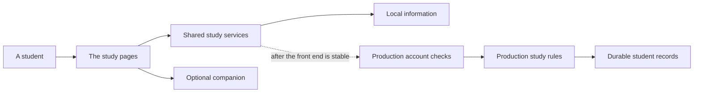

**Reading this:** The student uses the study pages. Those pages ask shared services to read or change information. The first version keeps that information locally and can show optional companion reactions. Only after the complete front-end experience is stable do the same services move through production account checks and server-side rules into durable student records. This matches [[05 - SYSTEM ARCHITECTURE]]. (`pokeden_product_build_documentation.md`, lines 73–85, 1026–1052, and 1119–1225)

## 2. How a job gets done — first-time setup

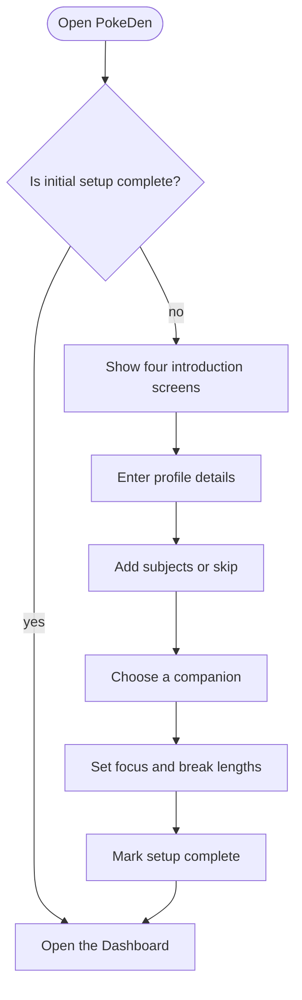

**Reading this:** PokeDen first checks whether setup is complete. Returning students go to the Dashboard. A new student sees the introduction, enters profile details, may add or skip subjects, chooses a companion, sets timer preferences, and then reaches the Dashboard. The document does not explain how a skipped or reset setup is resumed. (`pokeden_product_build_documentation.md`, lines 109–224 and 1231–1241)

## 3. How a job gets done — add an assignment

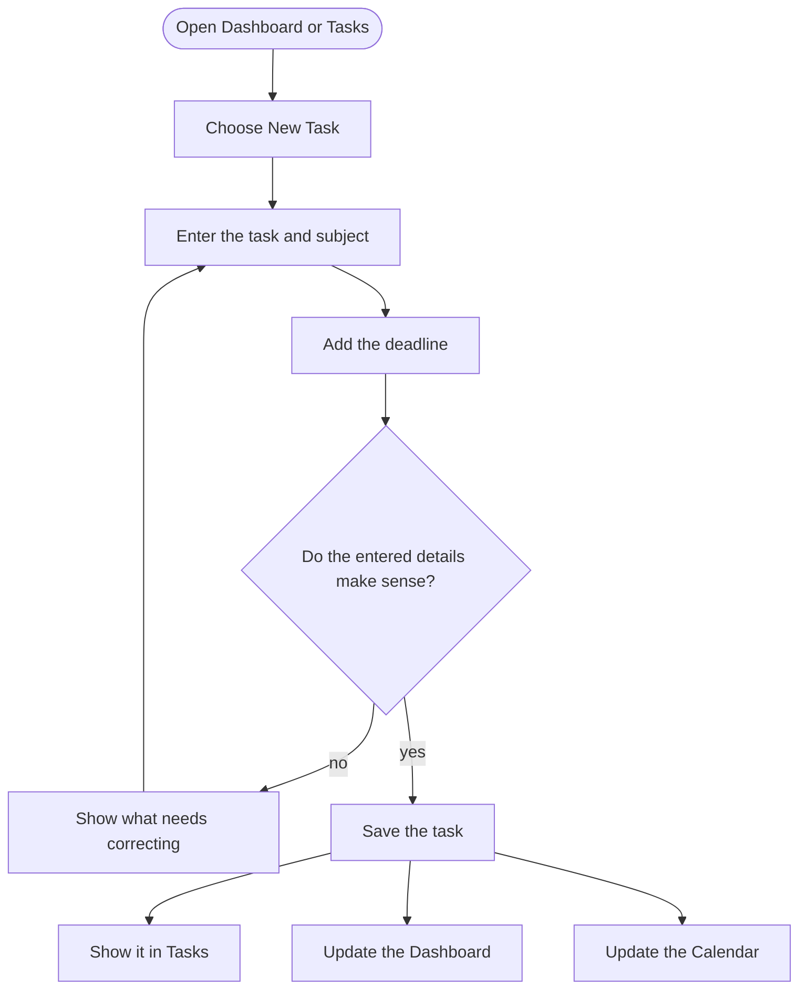

**Reading this:** The student opens Dashboard or Tasks, enters an assignment and deadline, and saves valid information. The assignment appears in Tasks while the Dashboard and Calendar update from the same source. The document requires input checking but leaves exact required fields to the form design. (`pokeden_product_build_documentation.md`, lines 381–432, 912–920, 1069–1076, and 1243–1254)

## 4. How a job gets done — plan and study

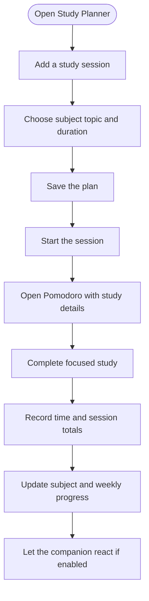

**Reading this:** A student plans a subject, topic, and duration. Starting that plan opens Pomodoro with the details already filled in. Completing focus records the session, updates progress, and may trigger a companion reaction. The document does not settle how partial sessions count. (`pokeden_product_build_documentation.md`, lines 460–506, 591–662, 931–947, and 1256–1270)

## 5. How a job gets done — take notes

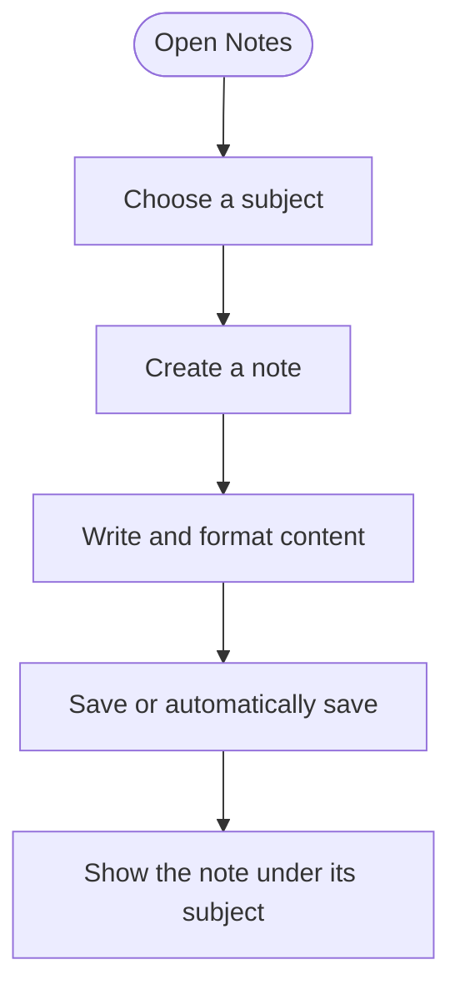

**Reading this:** The student chooses a subject, creates and writes a note, and saves it manually or through automatic saving. The note then appears under that subject. (`pokeden_product_build_documentation.md`, lines 509–562 and 1272–1281)

## 6. How a job gets done — prepare for an exam

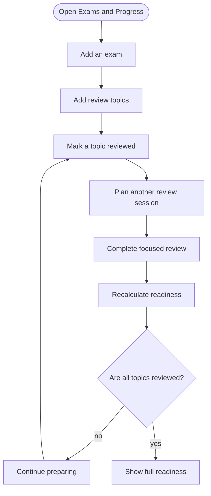

**Reading this:** The student adds an exam and its topics, marks review work, plans more sessions, and completes focused review. Readiness is based on the share of topics marked reviewed. Work continues until all topics are reviewed. (`pokeden_product_build_documentation.md`, lines 674–719 and 1283–1293)

## 7. Who talks to whom, in order — a completed focus session

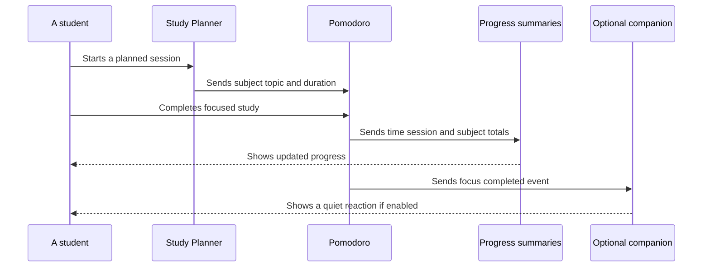

**Reading this:** Time moves down the picture. The student starts in Study Planner, which sends the study details to Pomodoro. Completion sends totals to Progress and an event to the optional companion. Solid arrows carry requests or updates; dashed arrows show what the student sees in return. (`pokeden_product_build_documentation.md`, lines 498–506, 623–662, and 931–947)

## 8. The life story of a task

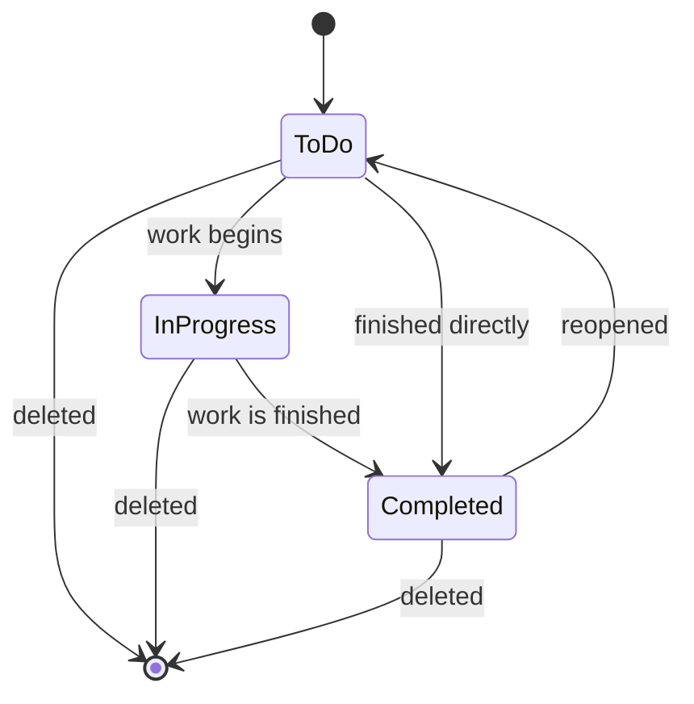

**Reading this:** A task begins as To Do. It may move into In Progress or be completed directly. A completed task may be reopened. Deleting a task ends its life from any listed state. The document names the statuses and actions but does not say whether reopening returns to To Do or In Progress; the arrow to To Do is therefore a proposed reading that needs confirmation in [[00 - START HERE#Open questions|Q-11]]. (`pokeden_product_build_documentation.md`, lines 395–432)

## 9. The life story of a focus session

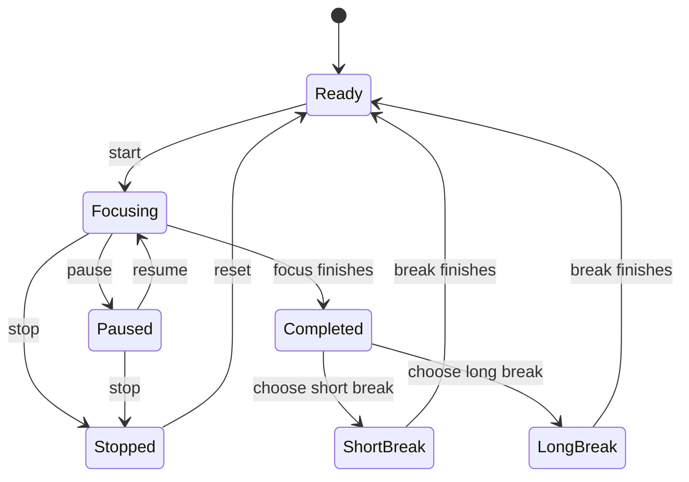

**Reading this:** The timer waits ready, moves into focus, may pause and resume, and can finish or stop. Completion can lead to a short or long break before returning to ready. A stopped session can be reset. The controls are specified, but the exact automatic movement between focus and breaks is not; this picture shows a conservative proposed flow. (`pokeden_product_build_documentation.md`, lines 585–612)

## 10. The companion’s main reactions

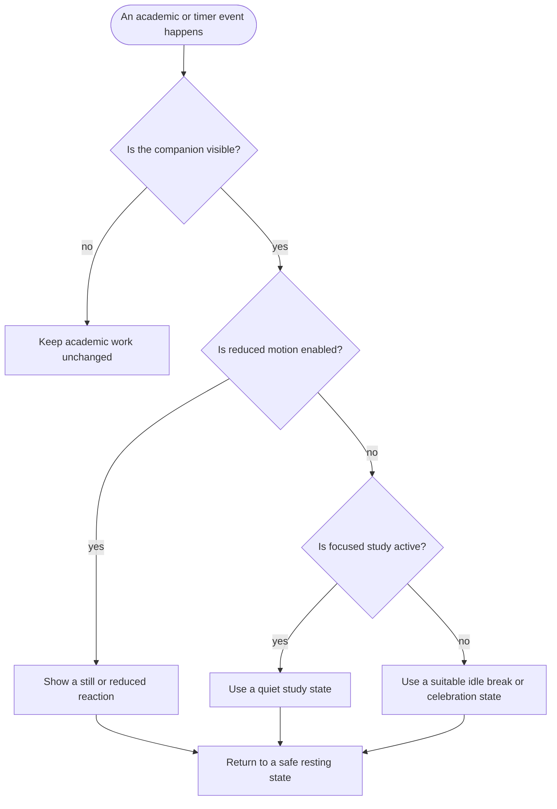

**Reading this:** Academic work never depends on the companion. Hidden companions do nothing visible. Reduced motion leads to a restrained response. During focus, the companion uses a quiet study state; at other times it may idle, rest, or celebrate before returning to a safe area. (`pokeden_product_build_documentation.md`, lines 67–71, 623–662, 816–822, and 830–905)

## 11. The order of the phases

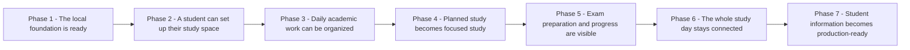

**Reading this:** Shared local foundations come first. Setup and subjects make daily work possible. Planning then feeds focused study, which supplies records for exam preparation and progress. Dashboard, Calendar, quality work, and full journeys connect everything before production accounts and durable storage begin. The order matches [[07 - DEVELOPMENT ROADMAP]].
